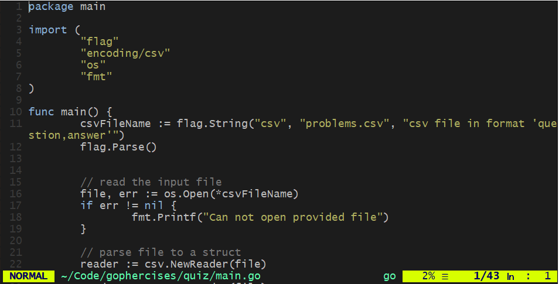

Я решил перейти на VIM. В данном цикле статей я буду рассказывать о своем опыте использования и настройки данного редактора.
Пользуюсь я им на данный момент ни много ни мало уже 2 дня.

#### Немного визуальной настройки
Я не знаю на самом деле, что люди делают в первую очередь, когда начинают пользоваться данным редактором, но первое, что захотелось сделать мне это настроить его внешний вид.

Для этого нам налр поставить пакетный менеджер для управления плагинами в VIM. Темы оформления ставятся также через него. 
Пакетных менеджеров есть несколько, я выбрал `Plug`, потому что у кого то подсмотрел.

Идем на [junegunn/vim-plug](https://github.com/junegunn/vim-plug), читаем как ставить, если вкратце, то
выполняем данную команду.
`curl -fLo ~/.vim/autoload/plug.vim --create-dirs https://raw.githubusercontent.com/junegunn/vim-plug/master/plug.vim`

Основной файл, через который мы производим всю конфигурацию - `~/.vimrc`. Лежит в домашней директории.

Добавляем данную секцию в `.vimrc`.
Здесь мы указываем пакетному менеджеру, откуда и докуда смотреть какие плагины нужно ставить.
Надо заметить, что после каждого сохранения `.vimrc`, его надо подгрузить. Делается это с помощью команды `:so %`.

```vimscript
" -----------------------Plugins------------------------
call plug#begin()
Plug 'kristijanhusak/vim-hybrid-material'
call plug#end()
```

Собственно строчка `Plug 'kristijanhusak/vim-hybrid-material'` говорит, что нам надо поставить [kristijanhusak/vim-hybrid-material](https://github.com/kristijanhusak/vim-hybrid-material). Если я правильно понимаю, то имя плагина полностью совпадает с именем репозитория, лежащего на гитхабе.

После того, как добавили все в `.vimrc` нам нужно поставить данные плагины.
Открываем VIM, и запускаем команду `:PlugInstall`. 
После этого мы можем прописать в нашем `.vimrc` то что мы хотим использовать свежескачанную тему. Для этого добавляем например в начало файла данные строки:
```vimscript
" Some styling
set background=dark
colorscheme hybrid_material
```
Однако тут подстава - Если перезапустить редактор - то он начнет ругаться на то, что у нас нет такой темы. VIM берет цветовые схемы из папки `~/.vim/colors/`. Соответственно нам нужно создать данные директории и скопировать установленные темы.

```bash
mkdir -p ~/.vim/colors
cp ~/.vim/plugged/vim-hybrid-material/colors/* ~/.vim/colors
```

После чего перезапускаем редактор и радуемся.

Теперь по поводу статусбара.

Ставим [vim-airline/vim-airline](https://github.com/vim-airline/vim-airline)
Для этого добавляем в раздел плагинов строку
`Plug 'vim-airline/vim-airline'` после чего далем :PlugInstall.
Туда же ставим `Plug 'tpope/vim-fugitive'` для интеграции с гитом.
Да, чуть не забыл - включить номера строк - `set number`

#### Немного хоткеев
Открывать и редактировать `.vimrc` нам нужно будет часто, так что удобно повесить какой-нибудь хоткей для этого действия.
```
nmap <Leader>v :tabedit $MYVIMRC<cr>
```
По умолчанию лидер-клавиша это обратный слеш - я переназначил на `,`
Для этого добавляем куда-нибудь в начало файла 
```
let mapleader = ','
```

Ну и чтобы каждый раз не набирать команду `:so %` после редактирования `.vimrc`, добавим автокоманду
```vimscript
" -----------------Autocommands---------------------
" Automaticly source .vimrc file on save
augroup autosourcing
	autocmd!
	autocmd BufWritePost .vimrc source %
augroup END
```
Это если можно так выразиться хук, который говорит, что каждый раз при сохранении файла `.vimrc`, мы будем делать source данного файла.

На первый раз это все. Щас я привыкаю к этому необычному управлению, навигации, разбираюсь с табами и буферами.
Продолжение следует...

